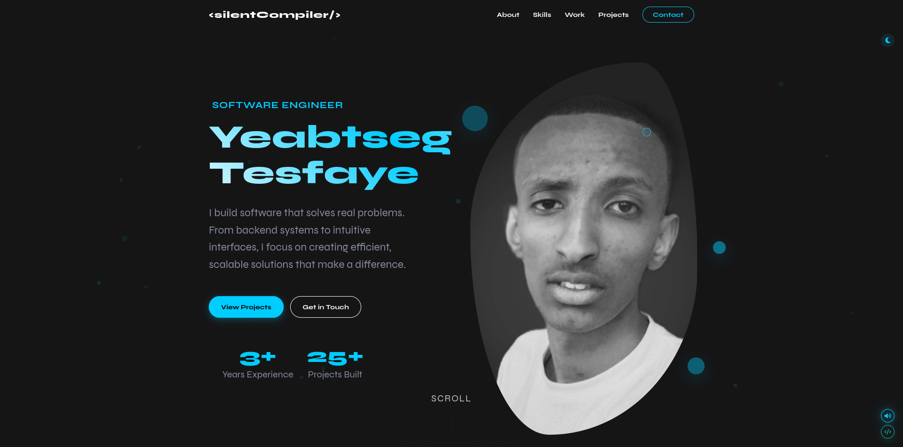
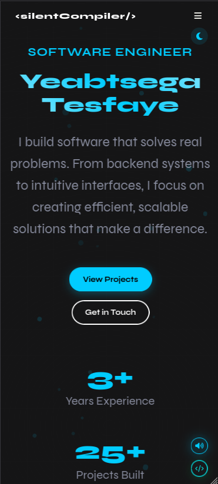
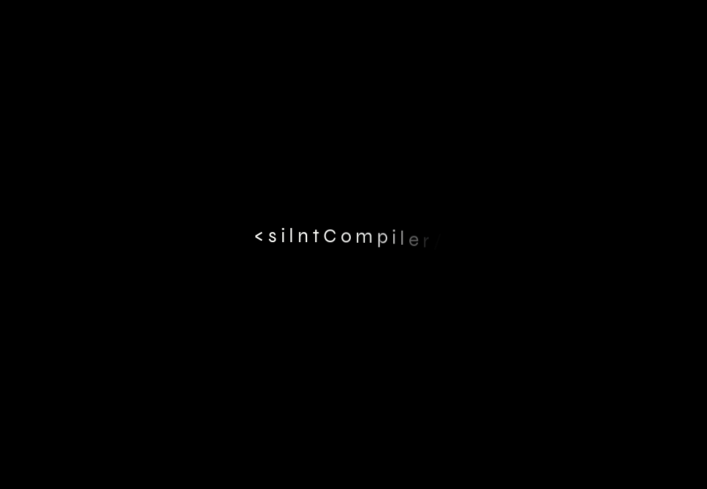

<div align="center">

# &lt;silentCompiler/&gt;

**Personal Portfolio — Yeabtsega Tesfaye**

[](https://yeab-tsega.netlify.app/)
[](https://github.com/Yeabtsega-Tesfaye/Personal-Website/blob/main/index.html)
[](https://github.com/Yeabtsega-Tesfaye/Personal-Website/tree/main/assets/css)
[](https://github.com/Yeabtsega-Tesfaye/Personal-Website/tree/main/assets/js)
[](https://yeab-tsega.netlify.app/)

</div>

---

> A handcrafted, zero-dependency portfolio built from scratch with vanilla HTML, CSS, and JavaScript — no frameworks, no build tools, no shortcuts. ~7,000 lines of deliberate front-end engineering.

---

## Preview
| Desktop View | Mobile View |
|---|---|
|  |  |

---

| Terminal intro |
|---| 
|    |


---

## Live Demo

**[→ yeab-tsega.netlify.app](https://yeab-tsega.netlify.app/)**

Deployed on Netlify with continuous deployment from the `main` branch. The site loads with a terminal-style intro sequence that sets the tone before giving way to the full portfolio experience.

---

## Table of Contents

- [Overview](#overview)
- [Tech Stack](#tech-stack)
- [Features](#features)
- [Project Structure](#project-structure)
- [Engineering & Design Philosophy](#engineering--design-philosophy)
- [CSS Architecture](#css-architecture)
- [JavaScript Systems](#javascript-systems)
- [Responsiveness & Performance](#responsiveness--performance)
- [Challenges & Lessons Learned](#challenges--lessons-learned)
- [Future Roadmap](#future-roadmap)
- [Local Setup](#local-setup)
- [Repository Improvements](#repository-improvements)
- [Screenshots Guide](#screenshots-guide)
- [Author](#author)

---

## Overview

This portfolio is not a template or a cloned starter. It is a ground-up frontend project built to serve two purposes simultaneously: to function as a professional introduction for potential clients and employers, and to serve as a serious technical exercise in what is achievable without a JavaScript framework or build pipeline.

The site encompasses a multi-section single-page layout with a custom terminal welcome sequence, physics-inspired magnetic button interactions, a real-time Canvas-based code rain background, an animated skills marquee with interactive popups, a structured projects/blog section, and a complete CSS design system defined through custom properties.

The separation of concerns across HTML (structure), CSS (presentation), and JavaScript (behavior) is strict throughout — an architectural discipline that makes the ~7,000-line codebase navigable without tooling.

---

## Tech Stack

| Layer | Technology | Notes |
|---|---|---|
| Structure | HTML5 | Semantic elements, ARIA labels, SEO meta tags |
| Styling | CSS3 | Custom properties, Grid, Flexbox, `@keyframes`, no preprocessor |
| Behavior | Vanilla JavaScript (ES6+) | No frameworks, no bundler |
| Typography | Syne (Google Fonts) | 400 / 600 / 700 / 800 weights |
| Icons | Font Awesome 6 + Devicons | Loaded via CDN |
| Deployment | Netlify | CD from `main` |
| Version Control | Git / GitHub | — |

**Deliberately excluded:** React, Vue, Sass, Webpack, Vite, jQuery, Bootstrap, Tailwind. Every visual effect and interaction is hand-implemented.

---

## Features

### Terminal Welcome System
A fully scripted terminal simulation runs before the main site loads. Lines of mock shell output are typed character-by-character using a sequenced queue, with a blinking cursor, realistic timing delays, and a "Skip Intro" escape hatch. The overlay fades out after the sequence completes, transitioning into the main site with a branded loader animation (`<silentCompiler/>`).

### Magnetic Button Physics
The hero CTA buttons implement a magnetic attraction effect: `mousemove` events calculate the cursor's offset from the button's center, and the button translates toward the cursor using CSS `transform`. On `mouseleave`, the button springs back to origin. Particle decorations orbit each button independently.

### Canvas Code Rain
A `<canvas>` element sits as a fixed background layer. A JavaScript engine renders a Matrix-inspired falling-character effect using the Canvas 2D API — managing column positions, character sets, random speeds, fade trails, and frame rate control via `requestAnimationFrame`. The effect is togglable without page reload, and respects `prefers-reduced-motion`.

### Skills Marquee with Interactive Popups
Technology skills are rendered in two infinitely looping rows (scrolling in opposite directions) using CSS `animation` and `translateX`. Each skill chip is clickable and triggers a centered popup card with skill metadata: category, experience level, and a deep-link to relevant GitHub repositories.

### Sound Effects System
UI interactions (hover, click, navigation) optionally trigger short audio cues. A toggle control persists the user's sound preference and shows an animated equalizer wave when active — a small but considered detail.

### Semantic HTML & Accessibility
Every interactive element carries an `aria-label`. Images have descriptive `alt` text. Navigation uses a proper `<ul>/<li>` list structure. Heading hierarchy (`h1` → `h3`) is maintained throughout sections.

### Blog Section
A structured blog section with article cards, timestamps in `<time>` elements with `datetime` attributes, and read-time estimates. Blog posts are external `.html` pages linked from the main portfolio.

---

## Project Structure

```
Personal-Website/
│
├── index.html                  # Single-page application entry point (~713 lines)
│
├── favicon.ico
├── style-guide.md              # Design token reference (colors, typography, spacing)
│
├── assets/
│   ├── css/
│   │   └── style.css           # Full stylesheet (~4,000 lines)
│   │
│   ├── js/
│   │   └── script.js           # All JS behavior (~2,000 lines)
│   │
│   ├── images/                 # Site photography and project thumbnails
│   │   ├── hero-banner.jpg
│   │   ├── about.jpg
│   │   ├── about-detail.jpg
│   │   ├── portfolio-*.jpg
│   │   └── ...
│   │
│   ├── blogs/
│   │   ├── blog1.html          # "Building My First Animated Website with GSAP"
│   │   └── blog2.html          # "What I Learned as a Beginner Freelancer"
│   │
│   └── cv/
│       └── CV.pdf              # Downloadable resume
│
└── readme-images/
    └── desktop.png             # README screenshot
```

The flat asset structure keeps everything discoverable without deep nesting. The `style-guide.md` serves as a living design token reference — a practice borrowed from component library documentation and useful for maintaining visual consistency across future additions.

---

## Engineering & Design Philosophy

### Vanilla-First as a Deliberate Constraint
The choice to avoid frameworks is not a limitation — it is the point. Building without React or Vue forces you to understand what those abstractions are hiding: DOM diffing, event delegation, state synchronization, animation timing. Writing these systems by hand produces a much clearer mental model of the browser runtime.

### CSS Custom Properties as a Design System
The entire visual system is defined through CSS custom properties at the `:root` level. Colors (`--raisin-black`, `--roman-silver`, `--eerie-black`), typography scale (`--fs-1` through `--fs-8`), spacing (`--section-padding`), border radii, and transition curves (`--cubic-bounce`, `--cubic-ease-out`) are all tokenized. This means a complete theme change requires editing one block, not hunting through thousands of lines.

### Behavioral Encapsulation in JavaScript
Despite being a single script file, `script.js` is organized into discrete, self-contained systems: the terminal engine, the magnetic effect handler, the Canvas rain renderer, the skills popup controller, and the sound system. Each system manages its own state and does not reach into another's DOM. This is manual module discipline — the same separation you would enforce with ES modules or a framework, achieved through convention.

### Separation of Concerns, Respected Literally
- HTML contains no `style=""` inline attributes (with rare justified exceptions)
- CSS contains no business logic
- JavaScript does not embed style strings — it toggles classes and reads CSS custom properties

### Performance-Conscious Animation
Animations prioritize `transform` and `opacity` — the two properties the browser can composite without layout recalculation. The Canvas rain uses `requestAnimationFrame` for smooth 60fps rendering. The skills marquee uses pure CSS `@keyframes` rather than a JavaScript scroll loop.

---

## CSS Architecture

The stylesheet is organized in a consistent top-down order:

```
1. :root — Design tokens (colors, fonts, spacing, easing)
2. Reset / base styles
3. Reusable utility classes (.container, .btn, .section, .eyebrow)
4. Component styles, ordered by DOM appearance:
   - Loader
   - Terminal overlay
   - Header / navigation
   - Hero section
   - About section
   - Services section
   - Skills (marquee + popup)
   - Portfolio grid
   - Blog grid
   - Footer / contact
   - Code rain canvas
   - Sound controls
5. Responsive overrides (mobile-first breakpoints)
```

The `blob-radius` custom property (`52% 48% 59% 41% / 53% 40% 60% 47%`) is used for the organic avatar shape on the hero — a deliberate design detail that softens the visual without requiring SVG clip-paths.

---

## JavaScript Systems

<details>
<summary><strong>Terminal Sequence Engine</strong></summary>

A command queue defines the lines to be typed. A recursive `typeNextLine()` function pulls commands off the queue, types each character with a configurable delay, appends the completed line as a DOM node with output text, then proceeds to the next command. A separate animation loop handles the cursor blink. The overlay is dismissed either when the queue empties or when the user clicks "Skip Intro."

</details>

<details>
<summary><strong>Magnetic Button Effect</strong></summary>

On `mousemove` over a `.btn-magnetic` container, the cursor position is measured relative to the button's bounding box center using `getBoundingClientRect()`. The delta is multiplied by a strength factor and applied as a CSS `translate` transform. On `mouseleave`, the transform is reset with a spring-like transition defined by `--cubic-bounce`. Each button has an independent particle container that animates in the same direction.

</details>

<details>
<summary><strong>Canvas Code Rain</strong></summary>

The canvas is sized to `window.innerWidth × window.innerHeight` and resized on `window.resize`. An array tracks one "drop" per column (column count = `Math.floor(width / fontSize)`). Each frame: the canvas is partially cleared with a semi-transparent black fill (creating the fade trail), then each drop renders a random Katakana/alphanumeric character at its current row. Drops reset to the top at random intervals to stagger the cascade. The toggle button adds/removes a class that stops the `rAF` loop.

</details>

<details>
<summary><strong>Skills Marquee & Popup</strong></summary>

Skills are defined as a JavaScript data array (name, icon class, category, experience, description, GitHub link). The array is injected into two DOM rows as rendered chips. The infinite scroll is driven entirely by CSS `animation: marquee linear infinite` on each row, with the second row using `animation-direction: reverse`. Click events on chips look up the corresponding data object by index and populate the popup card, which is shown with a CSS class toggle.

</details>

<details>
<summary><strong>Sound Controller</strong></summary>

Web Audio API (or `<audio>` elements) play short click/hover sounds tied to interaction events. A module-level `soundEnabled` boolean gates all audio calls. The toggle button updates the icon and animates the equalizer bars via CSS class. The preference is not persisted to `localStorage` — a deliberate choice to avoid surprising returning visitors with unexpected audio.

</details>

---

## Responsiveness & Performance

### Mobile-First Breakpoints
The layout is structured mobile-first. The hero section collapses from a two-column flex layout to a single-column stack on narrow viewports. The navigation collapses to a hamburger toggle. The services and portfolio grids reduce column count. The skills marquee adjusts chip sizing.

### Image Handling
The hero image uses a `data-src` lazy-load pattern (`src` points to a placeholder, `data-src` holds the full image) combined with an `IntersectionObserver` — the full image is only fetched when the element enters the viewport. A `<link rel="preload">` hint in the `<head>` pre-fetches the hero banner for perceived performance.

### Font Loading
Google Fonts are loaded with `rel="preconnect"` hints for both `fonts.googleapis.com` and `fonts.gstatic.com`, reducing the DNS + TCP handshake time before the font file can be requested. The `display=swap` parameter in the font URL prevents invisible text during load.

### Canvas Performance
The code rain canvas is a fixed, z-index-ordered layer behind the page content. It runs at the browser's native frame rate via `requestAnimationFrame`. When the user toggles it off, the loop is cancelled with `cancelAnimationFrame` — no wasted GPU compositing cycles.

### Accessibility Considerations
- All `<button>` elements have `aria-label` attributes
- Navigation items use `data-text` attributes for CSS-based hover effects (avoiding pseudo-element content duplication)
- Color contrast is maintained throughout the dark theme
- The terminal overlay is keyboard-escapable via the Skip button

---

## Challenges & Lessons Learned

**Terminal sequence timing**
Getting the terminal to feel natural — not too fast to read, not slow enough to be annoying — required iterating on per-character delay, inter-line pause, and output rendering. The solution was a queue-based approach with configurable timing constants rather than hardcoded `setTimeout` chains.

**Magnetic button edge cases**
The magnetic effect breaks when the button moves outside its original bounding box — the cursor-to-center calculation drifts because `getBoundingClientRect()` returns the current (transformed) position. The fix was to cache the initial bounding rect on `mouseenter` and use that cached value for the delta calculation throughout the hover session.

**Canvas resize handling**
Resizing the window resets canvas state — the column array becomes invalid for the new width. A debounced `resize` event listener rebuilds the column array cleanly rather than attempting to patch the existing one.

**CSS specificity at scale**
At 4,000 lines, specificity conflicts became a real maintenance issue. The discipline of keeping selectors shallow (one or two levels deep) and relying on BEM-like naming conventions prevented specificity wars. The design token system made global adjustments safe.

**Single-file JavaScript organization**
Without modules, the 2,000-line `script.js` risks becoming unmaintainable. The discipline applied here was strict function grouping with comment section headers, no global state pollution (all state is contained within IIFE-like closures or explicitly scoped variables), and zero cross-system function calls.

---

## Future Roadmap

- [ ] **Split CSS into component files** — Even without a build step, `@import` or a simple concatenation script would make the stylesheet easier to navigate
- [ ] **JavaScript ES Modules** — Refactor `script.js` into `terminal.js`, `magnetic.js`, `rain.js`, `skills.js`, `sound.js` with native `<script type="module">` loading
- [ ] **Intersection Observer for all scroll animations** — Replace any scroll-event listeners with `IntersectionObserver` for better performance
- [ ] **`prefers-reduced-motion` support** — Wrap all animation-heavy systems (terminal typing, code rain, magnetic buttons) in a `matchMedia` check
- [ ] **Dark/Light mode toggle** — The CSS custom property system makes this straightforward: a class on `<html>` switches the token values
- [ ] **GitHub API integration** — Pull live repository stats (stars, latest commit, language breakdown) into the projects section dynamically
- [ ] **PWA manifest + service worker** — Cache the static assets for offline access and "install" capability
- [ ] **OpenGraph image** — A custom `og:image` improves link preview appearance when the site is shared on LinkedIn or Twitter
- [ ] **Lighthouse score documentation** — Run and record Lighthouse scores (Performance, Accessibility, Best Practices, SEO) and display them in this README as badges

---

## Local Setup

No build tools. No package manager. No configuration files.

```bash
# Clone the repository
git clone https://github.com/Yeabtsega-Tesfaye/Personal-Website.git

# Enter the project directory
cd Personal-Website

# Open in browser
# Option 1: Direct file open
open index.html

# Option 2: Local server (recommended — avoids browser CORS restrictions on local assets)
# Using VS Code Live Server extension, or:
npx serve .
# Then visit http://localhost:3000
```

**Editing the design tokens:** All visual constants (colors, font sizes, spacing) are in `style.css` under the `:root` block, and documented separately in `style-guide.md`.

**Adding a project card:** In `index.html`, duplicate an `<article class="portfolio-card">` block inside the `.portfolio-grid` div and update the image src, title, description, and link.

**Modifying the skills list:** In `script.js`, locate the skills data array and add or update entries following the existing object shape.

---

## Repository Improvements

**Documentation**
- Document the skills data array schema in this README so it is clear how to extend the content layer
- Add Lighthouse performance scores as badges once measured

**GitHub profile hygiene**
- Pin this repository on your GitHub profile with a description that matches the README tone
- Add repository topics: `portfolio`, `frontend`, `vanilla-js`, `css-animations`, `html5`
- Replace the current repository description (the "inaugural web project" phrasing reads as tentative) with something that reflects the actual scope: *"Personal portfolio website. ~7k lines of vanilla HTML/CSS/JS — terminal intro, magnetic buttons, Canvas code rain, skills system."*

---

## Author

**Yeabtsega Tesfaye** — Software Engineering student, Woldia University, Ethiopia.

[](https://github.com/Yeabtsega-Tesfaye)
[](https://www.linkedin.com/in/dev-yeabtsega)
[](mailto:yeabtsegayeab85@gmail.com)
[](https://t.me/Confidential_boy)
[](https://yeab-tsega.netlify.app/)

---

<div align="center">

Built with deliberate care. No frameworks were harmed in the making of this website.

</div>
