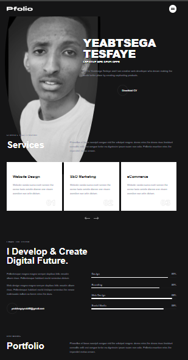

<div align="center">
  
  
  
  

  <br />
  <br />

  <h2 align="center">My Personal Portfolio Website</h2>

  A fully responsive personal portfolio website, <br />Responsive for all devices, build using HTML, CSS, and JavaScript.

  <a href="https://Yeabtsega-Tesfaye.github.io/Personal-Website/"><strong>➥ Live Demo</strong></a>

</div>

<br />

### Demo Screeshots



### Prerequisites

Before you begin, ensure you have met the following requirements:

* [Git](https://git-scm.com/downloads "Download Git") must be installed on your operating system.

### Run Locally

To run **Pfolio** locally, run this command on your git bash:

Linux and macOS:

```bash
sudo git clone https://github.com/Yeabtsega-Tesfaye/Personal-Website.git
```

Windows:

```bash
git clone https://github.com/Yeabtsega-Tesfaye/Personal-Website.git
```

### Contact

If you want to contact with me you can reach me yeabtsegayeab85@gmail.com.

### License

This project is **free to use** and does not contains any license.

Your portfolio website looks fantastic already! You've clearly put a lot of thought and effort into the design and features. The terminal intro, magnetic buttons, code rain effect, and responsive layout make it feel modern and engaging.

What's already great:

· ✅ Terminal welcome experience
· ✅ Interactive magnetic buttons
· ✅ Code rain background effect
· ✅ Responsive design
· ✅ Modern visual effects (blobs, floating elements)
· ✅ Good project showcase
· ✅ Sound controls (unique touch)

Here are some modern features you could add to make it even cooler:

---

1. 3D Elements with Three.js

· Add a 3D model of your workspace/avatar
· Interactive 3D skill "planets" that rotate on hover
· Floating 3D tech icons in the background

2. AI Integration

· AI Chatbot that answers questions about your experience
· Project summaries generated via AI on hover
· Smart recommendations for what section to view next

3. Advanced Interactions

· Parallax scrolling with depth layers
· Scroll-triggered animations (GSAP ScrollTrigger)
· Mouse-trail particles that follow cursor
· Holographic effect on project cards

4. Dynamic Content

· Live GitHub stats (commits, languages)
· Real-time visitor counter
· Dynamic project demos (iframes/videos)
· Blog RSS feed pulling latest posts

5. Game-like Elements

· Easter egg (konami code opens secret project)
· Achievement badges for exploring site
· Progress bar for "site exploration"
· Interactive tech tree of your skills

6. Performance & PWA Features

· Offline mode (cache projects/blog)
· Install as app (PWA)
· Performance metrics display (load time, etc.)
· Dark/light mode with automatic detection

7. Personalization

· Name/theme customization for visitors
· Note-taking on projects (localStorage)
· Bookmark projects for later
· Export portfolio as PDF feature

8. Cutting-edge Tech Demos

· Voice commands "Show me React projects"
· Hand gesture control (if webcam enabled)
· AR view of projects (with QR codes)
· WebGL shaders as section dividers

---

Quick Wins (Easy to implement):

1. Typing effect in the hero with rotating titles:
   ```js
   // "Software Engineer", "Full-Stack Developer", "Problem Solver"
   ```
2. Live code editor in projects section where visitors can tweak your code snippets.
3. Network graph of your skills showing connections.
4. Micro-interactions:
   · Buttons that "glitch" on hover
   · Text that scrambles and reforms
   · Icons that transform into something else
5. Background video with very subtle tech-themed motion.

---

My top 3 recommendations for your site:

1. Add a "Story Mode" - A timeline of your coding journey with interactive milestones.
2. Create a "Project Simulator" - Let visitors "build" a simple app with your stack in a simulated environment.
3. Implement WebSockets for real-time notifications (when you're online/available).

---

Considerations before adding:

· Performance: Each effect impacts load time
· Accessibility: Ensure all features work with keyboard/screen readers
· Mobile optimization: Some effects might not work well on mobile
· Purpose: Each feature should enhance UX, not just look cool

Your site is already in the top 5% of developer portfolios I've seen! The foundation is solid, so any additions should feel like natural enhancements rather than gimmicks.

Which direction interests you most? I can help you implement specific features with code snippets! 🚀
